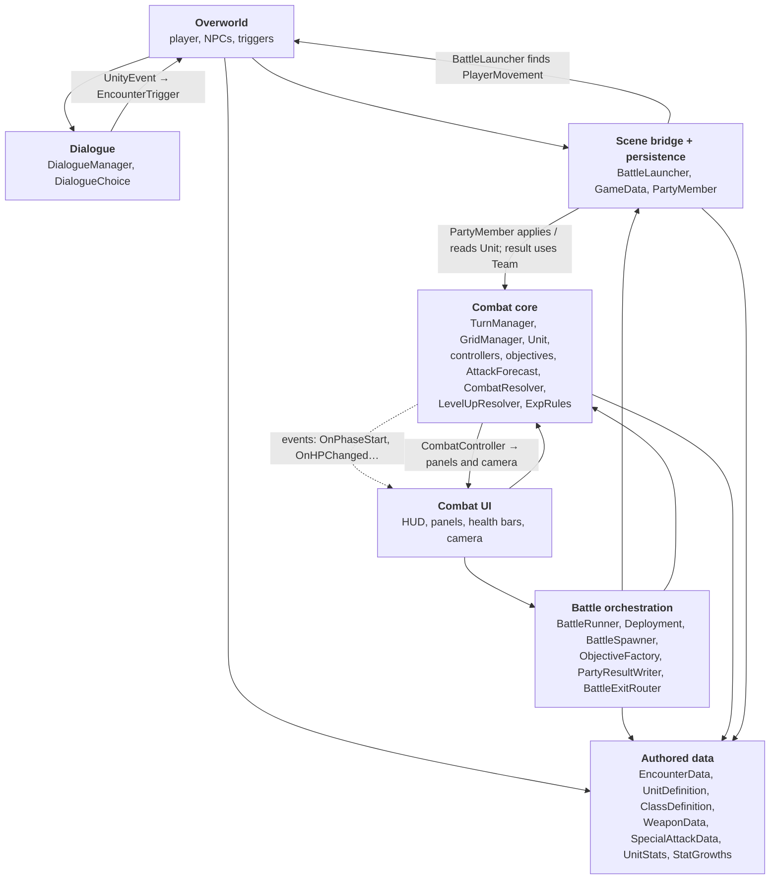

# 01 · Architecture overview

Which modules exist and which way the dependencies point. This is the diagram to check first
when adding a new script: find the module it belongs to, and make sure its new arrows point the
same way as the existing ones.

| Module | Scripts |
|--------|---------|
| Overworld | `PlayerMovement`, `PlayerCollisions`, `PlayerAnimationScript`, `PlayerInteractions`, `IInteractable`, `NPCScript`, `EncounterTrigger`, `OverworldPlayerPlacer`, `PlayerInputActions` (generated), `PlayerScript` (empty) |
| Dialogue | `DialogueManager`, `DialogueChoice` |
| Scene bridge + persistence | `BattleLauncher` (static), `GameData` (DontDestroyOnLoad), `PartyMember` |
| Battle orchestration | `BattleRunner`, `Deployment`, `BattleSpawner`, `ObjectiveFactory`, `PartyResultWriter`, `PartyRules`, `BattleExitRouter`, `ExitDecision`, `ExitRoute` |
| Combat core | `TurnManager`, `GridManager`, `Unit` (including `Unit.Progression`), `Team`, `CombatController`, `EnemyPhaseController`, `CombatObjective`, `DefeatBossObjective`, `SurviveRoundsObjective`, `AttackForecast`, `CombatResolver`, `LevelUpResolver`, `LevelUpResult`, `ExpRules` |
| Combat UI | `CombatHUD`, `UnitInfoPanel`, `BattleForecastPanel`, `UnitHealthBar`, `CombatCameraController` |
| Authored data | `EncounterData`, `UnitDefinition`, `ClassDefinition`, `ClassTier`, `WeaponData`, `DamageCategory`, `SpecialAttackData`, `UnitStats`, `StatGrowths` |
| Utility | `SceneManagerScript` (menu buttons) |

## Rules this diagram should enforce

- **Data depends on (almost) nothing.** ScriptableObjects and structs never reference scene objects. The one allowed exception is `UnitDefinition` knowing the `Unit` prefab type (`prefab`, `ApplyTo(Unit)`).
- **UI primarily depends on Combat.** Events are dotted notifications, not stored dependencies. `CombatController` directly calls the panels and `CombatCameraController`; this is the current exception to keeping presentation out of the core.
- **Scenes only talk through the bridge.** Overworld code never touches `TurnManager`; combat code never touches `PlayerMovement`.
- **Combat stays in the core.** `Unit.Attack()` calls `CombatResolver.ResolveCombat()`; it does not depend on the scene orchestrator.
