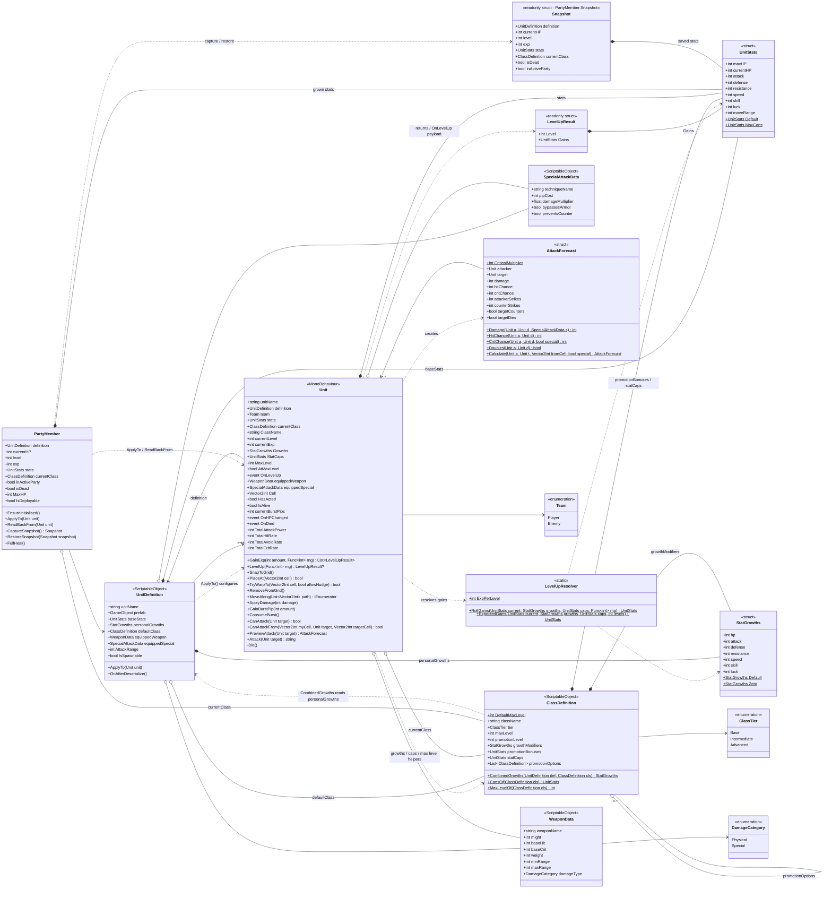

# 02 · Class diagram — units, stats, and authored data

The combat domain model: what a unit *is* (template vs. live instance) and what it carries.

## Reading notes

- **Template vs. instance:** `UnitDefinition` (asset, shared) → `PartyMember` (save-game state, persists across scenes) → `Unit` (scene object, lives for one battle). Keep this three-layer split explicit; it's what lets HP persist between fights.
- `*--` (composition) = `UnitStats` and `StatGrowths` are copied by value. Both support field-wise addition without clamping. `o--` (aggregation) = weapons/specials are shared asset references — never mutate them at runtime.
- Personal growths above 100 grant guaranteed points plus a remainder chance; negative growths become zero at roll time. `LevelUpResolver` uses injected rolls in [1,100], separate from combat's [0,99]. Expected gains round midpoint values away from zero.
- Classes hold authored growth modifiers, caps, tiers and promotion options only. `ApplyTo` sets the definition and default class and resets level/EXP to 1/0. Changing `currentClass` does not change personal growths or apply promotion bonuses. Promotion is not implemented.
- Starter assets: Oshawott and Piplup default to Base-tier Squire (zero modifiers/bonuses), whose promotion options are Intermediate-tier Vanguard and Tracker. All three use max level 20, promotion level 10 and `MaxCaps`. Vanguard adds HP/ATK/DEF growth +10 and SPD -5, with promotion bonuses HP +3/ATK +2/DEF +2. Tracker adds SPD +15/SKL +10/LCK +5/DEF -5 growth, with promotion bonuses SPD +2/SKL +2. All other modifiers and bonuses are zero.
- `UnitStats.MaxCaps` sets the seven combat ceilings to 99. Zero combat caps mean uncapped; an already over-cap stat never loses points. Current HP and movement caps are ignored; HP gains increase current HP by the same amount and movement never grows.
- `Unit.Progression` is part of the same `Unit` class. Its growths/caps/max-level properties use the null-safe class helpers. Bare units have zero growths and a level limit of 20.
- `GainExp` returns a result for each level gained and discards excess EXP on reaching the limit. Direct `LevelUp` returns null without side effects at max level. Successful levels apply stats, fire `OnHPChanged`, then `OnLevelUp(Unit, LevelUpResult)`; no UI subscribes here. Combat EXP awards are separate work.
- `PartyMember.level == 0` is the serialized initialization sentinel. Seed stats, class and level before resolving HP -1. `MaxHP` reads grown stats. `PartyMember.currentHP` is the sole persistent HP owner; its `stats.currentHP` is dead data. `ApplyTo` copies grown stats before overwriting live HP, while `ReadBackFrom` copies progression only and never writes member HP.
- Snapshots copy all member fields, including death/active-party flags and class, so retry restores the original state exactly. Progression persists in memory across battles; disk serialization remains future work.
- Legacy proxy properties (`maxHP`, `attack`, `defense`, … on both `Unit` and `UnitDefinition`) are omitted on purpose. If you're keeping them, mark them `[Obsolete]` so the diagram and the code agree.
