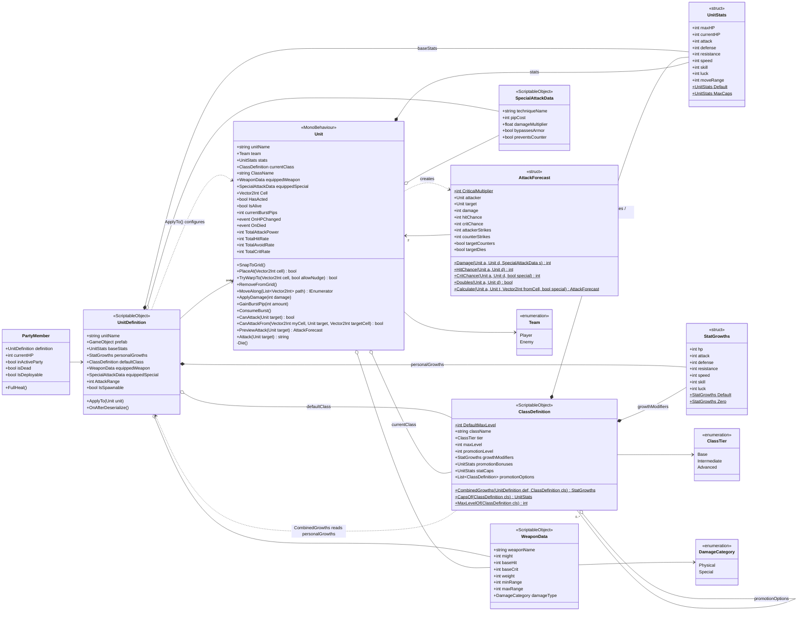

# 02 · Class diagram — units, stats, and authored data

The combat domain model: what a unit *is* (template vs. live instance) and what it carries.

## Reading notes

- **Template vs. instance:** `UnitDefinition` (asset, shared) → `PartyMember` (save-game state, persists across scenes) → `Unit` (scene object, lives for one battle). Keep this three-layer split explicit; it's what lets HP persist between fights.
- `*--` (composition) = `UnitStats` and `StatGrowths` are copied by value. Both support field-wise addition without clamping. `o--` (aggregation) = weapons/specials are shared asset references — never mutate them at runtime.
- Personal growths are percentage data only: values above 100 are legal, and negative values are preserved until roll time. No growth rolling is implemented yet.
- Classes hold authored growth modifiers, caps, tiers and promotion options only. `ApplyTo` copies the default class reference onto the unit; changing `currentClass` does not change personal growths or apply promotion bonuses. Promotion and leveling are not implemented yet.
- `UnitStats.MaxCaps` sets the seven combat ceilings to 99; current HP and movement are never capped and their cap fields are zero. A zero combat cap is reserved to mean uncapped when level-up resolution is added.
- Legacy proxy properties (`maxHP`, `attack`, `defense`, … on both `Unit` and `UnitDefinition`) are omitted on purpose. If you're keeping them, mark them `[Obsolete]` so the diagram and the code agree.
