# 03 · Class diagram — battle orchestration

Who runs a battle, who decides it's over, and who reacts.

```mermaid
classDiagram
    direction TB

    class BattleRunner {
        <<MonoBehaviour · order -100>>
        +BattleRunner Instance$
        +EncounterData debugEncounter
        +bool autoReturn
        -Deployment deployment
        -bool resultsWritten
        -bool leaving
        -Awake()
        -Start()
        -HandleCombatEnd(Team? winner)
        -ReturnAfterDelay() IEnumerator
        +Retry()
        +ReturnNow()
    }
    class Deployment {
        +Dictionary deployed
        +Dictionary snapshotBeforeBattle
        +List~KeyValuePair~ pendingPlacement
        +Unit Boss
    }
    class BattleSpawner {
        <<static>>
        +Spawn(EncounterData encounter, GameData data, Object context) Deployment
        +Place(Deployment deployment, GridManager grid)
    }
    class ObjectiveFactory {
        <<static>>
        +Install(EncounterData encounter, Deployment deployment, Transform parent)
    }
    class PartyRules {
        <<struct>>
        +bool permadeath
        +int reviveHP
        +bool healAfterBattle
    }
    class PartyResultWriter {
        <<static>>
        +Write(deployed, bool victory, PartyRules rules, Action heal)
        +Restore(snapshots)
    }
    class BattleExitRouter {
        <<static>>
        +Decide(bool victory, EncounterData encounter, string currentScene, string returnScene) ExitDecision
    }
    class ExitDecision {
        <<struct>>
        +ExitRoute Route
        +string SceneName
    }
    class ExitRoute {
        <<enumeration>>
        ReturnToOverworld
        Retry
        GameOver
    }
    class CombatResolver {
        <<static>>
        +ResolveCombat(Unit attacker, Unit defender, Func~int~ roll, bool useSpecial, Func~int~ growthRoll) string
    }

    class TurnManager {
        <<MonoBehaviour>>
        +TurnManager Instance$
        +Team CurrentPhase
        +int RoundNumber
        +bool CombatStarted
        +bool IsPlayerActionInProgress
        +bool CanEndPlayerPhase
        +bool CombatOver
        +Team? Winner
        +event OnPhaseStart
        +event OnRoundStart
        +event OnUnitDied
        +event OnCombatEnd
        -List~Unit~ allUnits
        -CombatObjective[] objectives
        -int exchangeDepth
        -bool combatEndPending
        +BeginExchange()
        +EndExchange()
        +RegisterUnit(Unit u)
        +UnregisterUnit(Unit u)
        +UnitsOnTeam(Team t) IEnumerable~Unit~
        +NotifyUnitActed(Unit u)
        +NotifyUnitDied(Unit u)
        +EndPhaseEarly(Team t)
        +CheckCombatEnd() bool
        +RegisterObjective(CombatObjective o)
        -BeginPhase(Team t)
        -EndPhase()
        -EndCombat(Team? winner)
    }

    class GridManager {
        <<MonoBehaviour>>
        +GridManager Instance$
        -Unit[,] occupants
        +WorldToCell(Vector3 p) Vector2Int
        +CellToWorld(Vector2Int c) Vector3
        +IsWalkable(Vector2Int c) bool
        +GetUnitAt(Vector2Int c) Unit
        +MoveUnit(Vector2Int from, Vector2Int to, Unit u)
        +GetPath(...) List~Vector2Int~
        +GetDistanceField(...) Dictionary
        +GetReachableCells(Vector2Int start, int range) HashSet
    }

    class CombatObjective {
        <<abstract>>
        +int priority
        +IsResolved(TurnManager t, out Team? winner)* bool
        +Describe() string
    }
    class DefeatBossObjective {
        +Unit boss
        +Team winsWhenBossFalls
    }
    class SurviveRoundsObjective {
        +int rounds
        +Team survivingTeam
    }

    class CombatController {
        <<MonoBehaviour · player input>>
        -State state
        -Unit selectedUnit
        -bool inputLocked
        -HandleLeftClick(Vector2Int c)
        -Select(Unit u)
        -MoveSelectedTo(Vector2Int dest) IEnumerator
        -ResolveAttack(Unit a, Unit t) IEnumerator
        -FinishUnitTurn()
    }

    class EnemyPhaseController {
        <<MonoBehaviour · AI>>
        +float actionDelay
        -HandlePhaseStart(Team t)
        -RunEnemyPhase() IEnumerator
        -TakeEnemyTurn(Unit e) IEnumerator
        -FindNearestPlayer(Unit e) Unit
        -FindBestApproachCell(Unit e, Unit t) Vector2Int
    }

    class CombatHUD {
        <<MonoBehaviour · UI>>
        -HandlePhaseStart(Team t)
        -HandleRoundStart(int r)
        -HandleCombatEnd(Team? w)
        -OnEndTurnPressed()
    }

    class EncounterData {
        <<ScriptableObject>>
        +List~EnemySpawn~ enemies
        +List~Vector2Int~ playerSpawnCells
        +VictoryCondition victory
        +DefeatAction onDefeat
        +Validate() bool
        +FindBossSpawn() EnemySpawn
    }

    class EnemySpawn {
        <<EncounterData.EnemySpawn>>
        +UnitDefinition definition
        +int level
        +ClassDefinition classOverride
        +Vector2Int cell
        +string nameOverride
        +bool isBoss
    }

    class VictoryCondition {
        <<enumeration>>
        RoutEnemies
        DefeatBoss
        SurviveRounds
    }
    class DefeatAction {
        <<enumeration>>
        ReturnToOverworld
        RetryBattle
        LoadGameOverScene
    }

    CombatObjective <|-- DefeatBossObjective
    CombatObjective <|-- SurviveRoundsObjective

    BattleRunner --> EncounterData : reads
    BattleRunner *-- Deployment
    BattleRunner ..> BattleSpawner : Awake spawn / Start place
    BattleRunner ..> ObjectiveFactory : Awake install
    BattleRunner ..> PartyResultWriter : write / restore
    BattleRunner ..> PartyRules : copies GameData settings
    BattleRunner ..> BattleExitRouter : decide
    BattleExitRouter ..> ExitDecision : returns
    ExitDecision --> ExitRoute
    BattleSpawner ..> Deployment : creates
    BattleSpawner ..> PartyMember : ApplyTo / CaptureSnapshot
    BattleSpawner ..> LevelUpResolver : ExpectedGains for enemies
    EncounterData *-- EnemySpawn
    EnemySpawn o-- UnitDefinition : definition
    EncounterData --> VictoryCondition
    EncounterData --> DefeatAction
    EnemySpawn o-- ClassDefinition : classOverride
    BattleSpawner ..> TurnManager : RegisterUnit
    BattleSpawner ..> GridManager : CellToWorld
    ObjectiveFactory ..> Deployment : reads Boss
    ObjectiveFactory ..> CombatObjective : configure inactive then activate
    ObjectiveFactory ..> TurnManager : RegisterObjective
    PartyResultWriter ..> PartyRules
    PartyResultWriter ..> PartyMember : ReadBackFrom before HP rules / RestoreSnapshot
    Unit ..> CombatResolver : Attack
    CombatResolver ..> AttackForecast : combat math
    CombatResolver ..> ExpRules : EXP math
    CombatResolver ..> TurnManager : BeginExchange / finally EndExchange
    TurnManager o-- "0..*" CombatObjective
    TurnManager o-- "0..*" Unit
    GridManager o-- "0..*" Unit : occupants

    CombatController ..> TurnManager : action guard / NotifyUnitActed
    CombatController ..> Unit : MoveAlong / PreviewAttack / Attack
    CombatController --> UnitInfoPanel : Show / Hide
    CombatController --> BattleForecastPanel : Show / Hide
    CombatController --> CombatCameraController : FocusOn
    CombatController ..> GridManager : paths, reachable
    EnemyPhaseController ..> TurnManager : NotifyUnitActed
    EnemyPhaseController ..> GridManager : distance fields

    TurnManager ..> EnemyPhaseController : OnPhaseStart
    TurnManager ..> CombatHUD : OnPhaseStart / OnRoundStart / OnCombatEnd
    TurnManager ..> BattleRunner : OnCombatEnd
    CombatHUD ..> BattleRunner : Retry / ReturnNow
    CombatHUD ..> TurnManager : CanEndPlayerPhase / EndPhaseEarly
```

## Reading notes

- `IsPlayerActionInProgress` has a public getter and internal setter. `CombatController` sets it during movement and attack resolution (including the pause), clearing it in `finally`. `CanEndPlayerPhase` requires started, unresolved player combat with no action in progress; both the HUD button and `EndPhaseEarly(Player)` honor it.
- `BeginExchange`/`EndExchange` form a nestable boundary for death-triggered end checks. `NotifyUnitDied` still publishes `OnUnitDied` immediately; the outermost `EndExchange` performs a pending check once. `CombatResolver` opens the boundary before strikes and closes it in `finally`, after EXP awards and level-ups, so winning-blow progression is included in party writeback. Other direct `CheckCombatEnd` callers are unchanged.
- Dashed arrows labelled with an event name point from **publisher → subscriber**. Those are the "good" couplings: `TurnManager` doesn't know who's listening.
- `CombatController` and `EnemyPhaseController` are two *controllers of the same kind* (one per team) but share no abstraction. They each re-implement "move along path, then maybe attack, then NotifyUnitActed". That's the best candidate for a shared interface — see README.
- `BattleRunner` owns timing and applies the chosen exit: restore the complete member snapshot for Retry; otherwise clear Pending; then load the chosen scene. Explicit Retry and automatic/Continue RetryBattle use the same `PartyResultWriter.Restore` call. The router never loads scenes.
- `PartyResultWriter` receives collections, `PartyRules`, and a heal callback; it never looks up `GameData` or scene objects.
- Boss identity comes directly from the first eligible `isBoss` spawn, without name/cell matching. Objective fields are assigned before activation and `Awake`.

- `Deployment.deployed` maps Unit to PartyMember; `snapshotBeforeBattle` maps PartyMember to its complete pre-battle state (HP, level, EXP, stats, class, definition and flags); `pendingPlacement` pairs Unit with its requested cell.
- Enemies resolve class override before default class, including at level 1. Higher levels apply deterministic expected gains for level minus one, then spawn at full HP. Validation warns above the resolved class's max level; it does not clamp the authored level to that maximum.
