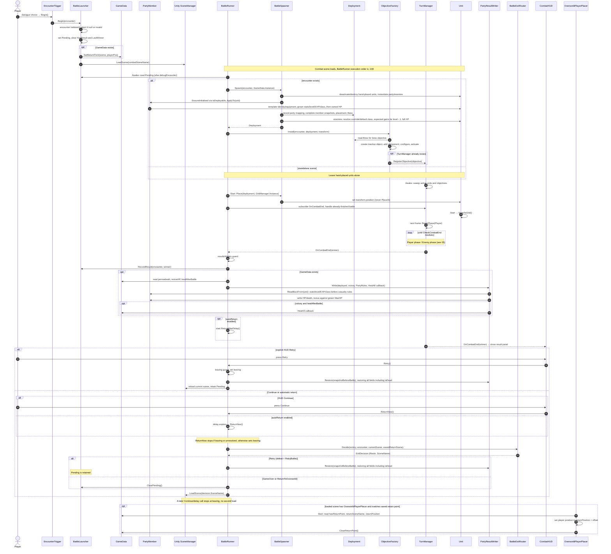

# 04 · Sequence — overworld → battle → overworld

The encounter round-trip, including setup order and guarded automatic/manual exits.

`BattleExitRouter` chooses Retry only for a defeat with `RetryBattle`. Defeat with
`LoadGameOverScene` uses GameOver only if its name is nonblank. All other cases return
using the encounter's return scene, then GameData's saved return scene, then `OverworldScene`.
Victory ignores the defeat action. A draw follows the defeat path.

Automatic return starts only after results are recorded and written. With `autoReturn` off,
the HUD drives the exit. Both `Retry()` and `ReturnNow()` set `leaving` before any scene load.
`ReturnAfterDelay` uses scaled time (`WaitForSeconds`), as before.

The diagram follows a valid launch; invalid encounters stop before setting Pending or loading
a scene. `OverworldPlayerPlacer` consumes a return point only in its saved scene.
The HUD shows Continue on victory and Retry/Main Menu on defeat or draw. The return router's
defeat branches are reached by automatic return or another caller of `ReturnNow()`.
