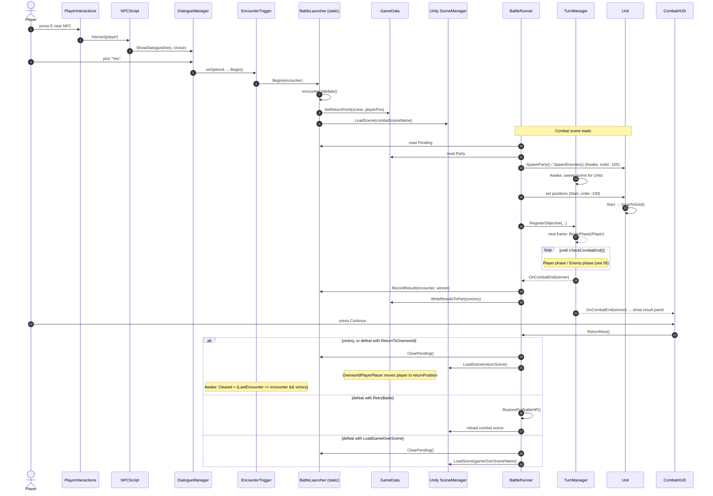

# 04 · Sequence — overworld → battle → overworld

The full encounter round-trip, including the execution-order trick in `BattleRunner`.

`autoReturn` and `ReturnAfterDelay()` exist in `BattleRunner` but nothing calls them, so the only
way out of a battle is a HUD button. Either wire them up or delete them.