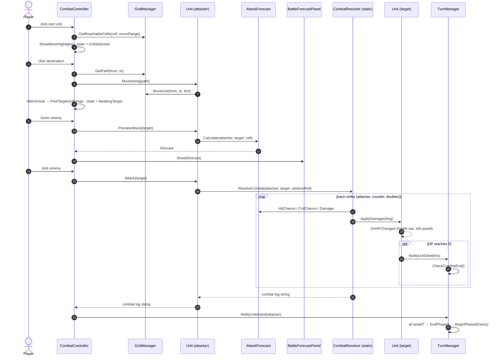

# 05 · Sequence — one player unit's turn (move + attack)

```mermaid
sequenceDiagram
    autonumber
    actor Player
    participant CC as CombatController
    participant GM as GridManager
    participant A as Unit (attacker)
    participant AF as AttackForecast
    participant FP as BattleForecastPanel
    participant CR as CombatResolver (static)
    participant T as Unit (target)
    participant TM as TurnManager

    Player->>CC: click own unit
    CC->>GM: GetReachableCells(cell, moveRange)
    CC->>CC: ShowMoveHighlights · state = UnitSelected

    Player->>CC: click destination
    CC->>GM: GetPath(from, to)
    CC->>A: MoveAlong(path)
    A->>GM: MoveUnit(from, to, this)
    CC->>CC: AfterArrival → FindTargetsInRange · state = AwaitingTarget

    Player->>CC: hover enemy
    CC->>A: PreviewAttack(target)
    A->>AF: Calculate(attacker, target, cell)
    AF-->>CC: forecast
    CC->>FP: Show(forecast)

    Player->>CC: click enemy
    CC->>A: Attack(target)
    A->>CR: ResolveCombat(attacker, target, randomRoll)
    loop each strike (attacker, counter, doubles)
        CR->>AF: HitChance / CritChance / Damage
        CR->>T: ApplyDamage(dmg)
        T-->>T: OnHPChanged (health bar, info panel)
        opt HP reaches 0
            T->>TM: NotifyUnitDied(this)
            TM->>TM: CheckCombatEnd()
        end
    end
    CR-->>A: combat log string
    A-->>CC: combat log string
    CC->>TM: NotifyUnitActed(attacker)
    TM->>TM: all acted? → EndPhase() → BeginPhase(Enemy)
```
