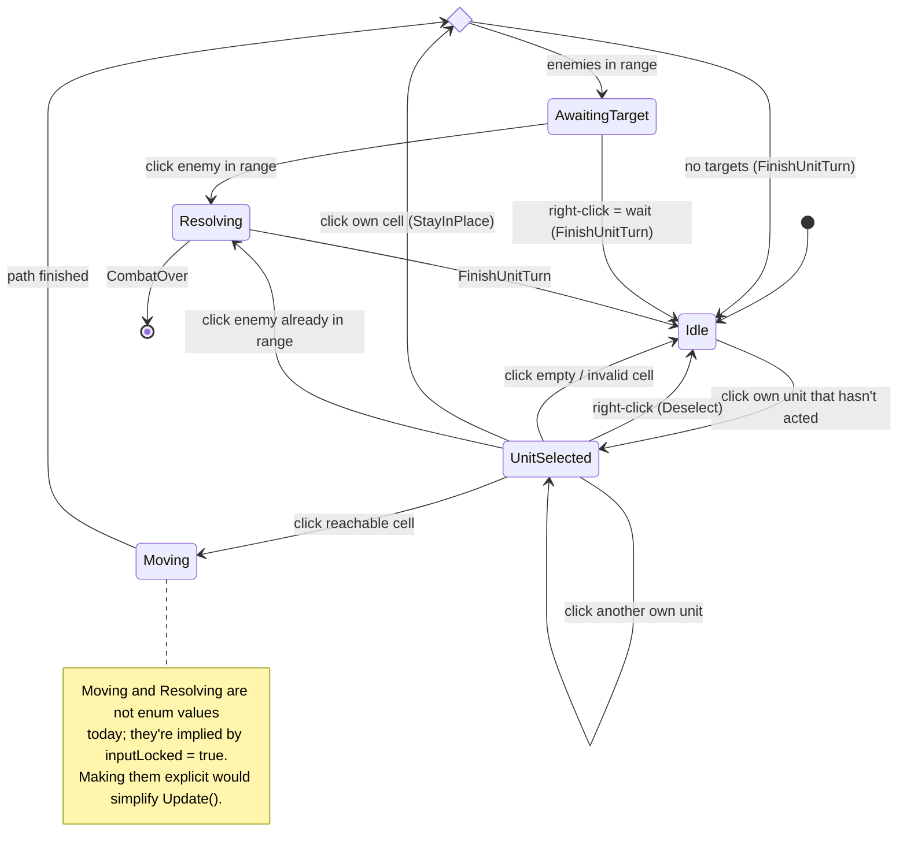
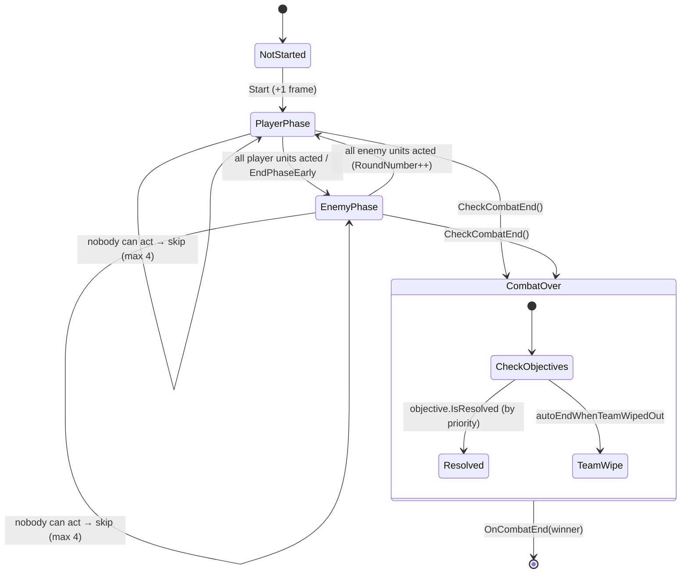

# 06 · State machines

## CombatController input state

`private enum State { Idle, UnitSelected, AwaitingTarget }` plus the `inputLocked` flag.

```mermaid
stateDiagram-v2
    state AfterArrival <<choice>>
    [*] --> Idle
    Idle --> UnitSelected : click own unit that hasn't acted
    UnitSelected --> Idle : right-click (Deselect)
    UnitSelected --> UnitSelected : click another own unit
    UnitSelected --> Idle : click empty / invalid cell
    UnitSelected --> Moving : click reachable cell
    UnitSelected --> AfterArrival : click own cell (StayInPlace)
    UnitSelected --> Resolving : click enemy already in range
    Moving --> AfterArrival : path finished
    AfterArrival --> AwaitingTarget : enemies in range
    AfterArrival --> Idle : no targets (FinishUnitTurn)
    AwaitingTarget --> Resolving : click enemy in range
    AwaitingTarget --> Idle : right-click = wait (FinishUnitTurn)
    Resolving --> Idle : FinishUnitTurn
    Resolving --> [*] : CombatOver


    note right of Moving
        Moving and Resolving are not enum values
        today; they're implied by inputLocked = true.
        Making them explicit would simplify Update().
    end note
```

## TurnManager battle lifecycle

```mermaid
stateDiagram-v2
    [*] --> NotStarted
    NotStarted --> PlayerPhase : Start (+1 frame)
    PlayerPhase --> EnemyPhase : all player units acted / EndPhaseEarly
    EnemyPhase --> PlayerPhase : all enemy units acted (RoundNumber++)
    PlayerPhase --> PlayerPhase : nobody can act → skip (max 4)
    EnemyPhase --> EnemyPhase : nobody can act → skip (max 4)
    PlayerPhase --> CombatOver : CheckCombatEnd()
    EnemyPhase --> CombatOver : CheckCombatEnd()
    CombatOver --> [*] : OnCombatEnd(winner)

    state CombatOver {
        [*] --> CheckObjectives
        CheckObjectives --> Resolved : objective.IsResolved (by priority)
        CheckObjectives --> TeamWipe : autoEndWhenTeamWipedOut
    }
```