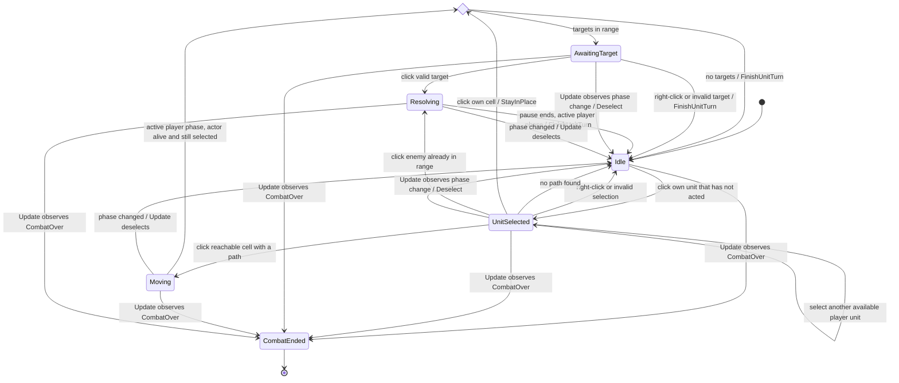
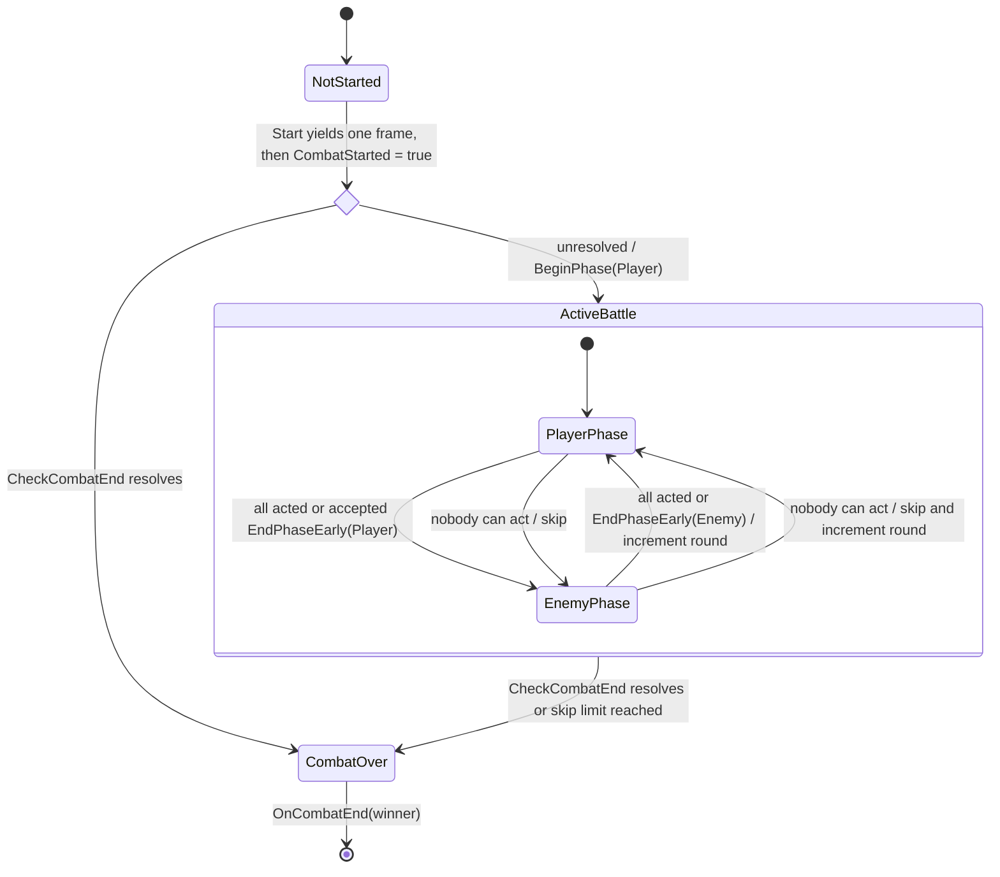
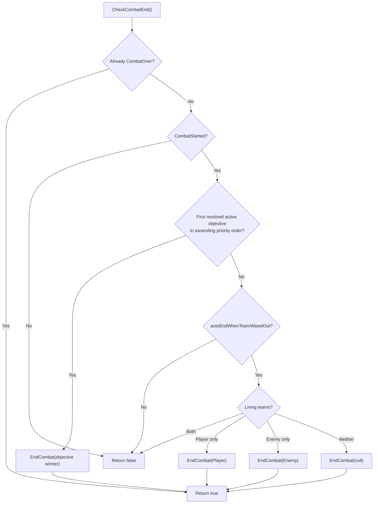

# 06 · State machines

## CombatController input state

`private enum State { Idle, UnitSelected, AwaitingTarget }` plus `inputLocked`.
Moving and Resolving below are coroutine activities, not enum values. Both set
`TurnManager.IsPlayerActionInProgress` and clear it with `inputLocked` in `finally`.
The HUD and `EndPhaseEarly(Player)` use `CanEndPlayerPhase` to block End Turn during them.

`Update` ignores gameplay input until combat starts, outside player phase, while locked,
or over UI. Hover panels can still update during either team's active phase. Combat-end
cleanup runs once and hides panels. A movement coroutine also stops without `AfterArrival`
if its manager/actor disappears, the actor dies, or selection changes.

## TurnManager battle lifecycle

Each `BeginPhase` checks combat end before entering its skip loop. It resets the acting
team's living units, then skips to the other team if none can act. After four consecutive
skips, another unactable phase ends in a draw. Skipped phases do not publish `OnPhaseStart`;
leaving an enemy phase increments `RoundNumber` and publishes `OnRoundStart`.
`CanStillAct` requires a living unit on the grid, on the acting team, that has not acted.

Win-condition evaluation is a decision flow that runs **before** entering `CombatOver`:

`NotifyUnitDied` publishes `OnUnitDied` immediately. During a combat exchange it defers
its end check until the outermost `EndExchange`, after EXP and level gains. Direct
`CheckCombatEnd` calls (including roster removal and phase start) are not deferred.
